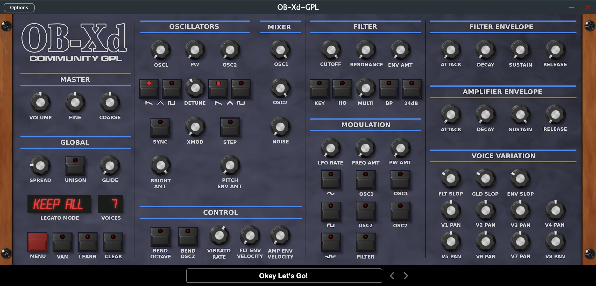

# OB-Xd Community GPL

This is a community GPL 3.0 version of OB-Xd. Pull requests welcome! Mac AU and Standalone in the APPS folder. When you download the project move it to your Documents, the path to "Themes" lives there.

The default theme in Resources, and in the screenshot above, was created by [gitterdude](https://github.com/gitterdude).

# About

OB-Xd is based on the [Oberheim OB-X](https://wikipedia.org/wiki/Oberheim_OB-X). It attempts to recreate its sound and behavior, but as the original was very limited in some important ways a number of things were added or altered to the original design. OB-Xd was designed to sound as good and as rich as the original. It implements micro random detuning which is a big part of that sound.

While not copying originals, some of the features were taken to a better point. Continuous blendable multimode filter (HP-Notch(BP)-HP in 12 dB mode and 4-1 pole in 24 dB mode). Also, like many synths of the OB-X's generation, the OB-Xd has no internal effects so its sounds and textures can be greatly enhanced by the use of additional processing like chorus, reverb, delay, etc.

Thanks to [2Dat](https://github.com/2DaT/Obxd) for the original OB-Xd and Soshi Studio for giving the rights to continue this wonderful product.

# Building

Currently there are Mac AU and Mac Standalone in the APPS folder.

Source code can be compiled with [JUCE 7.0.3](https://github.com/juce-framework/JUCE/releases/tag/7.0.3). 

# Copyright

This repository and the source code is under GPL3 license.
